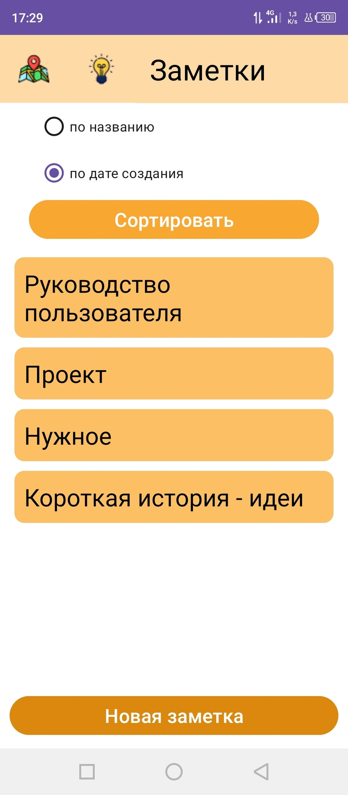
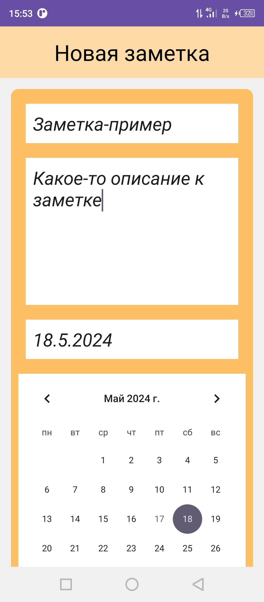
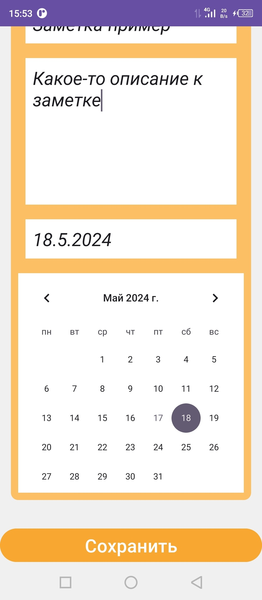
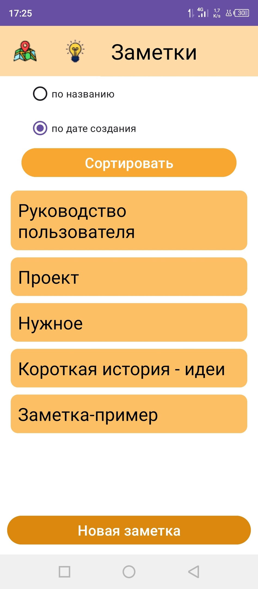
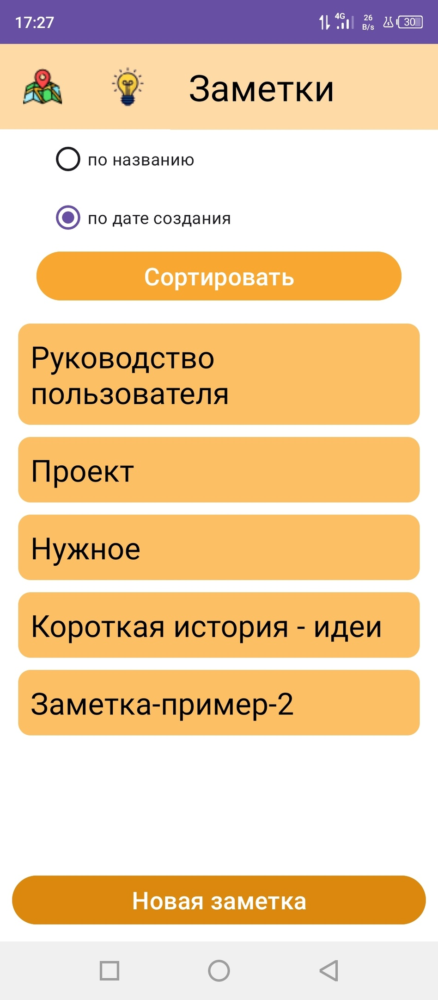
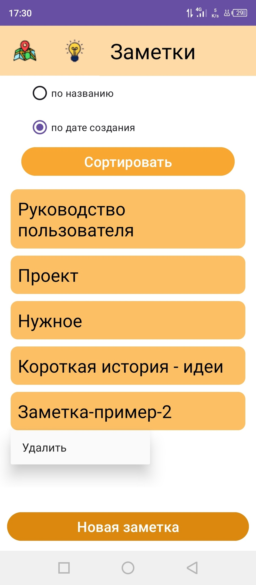
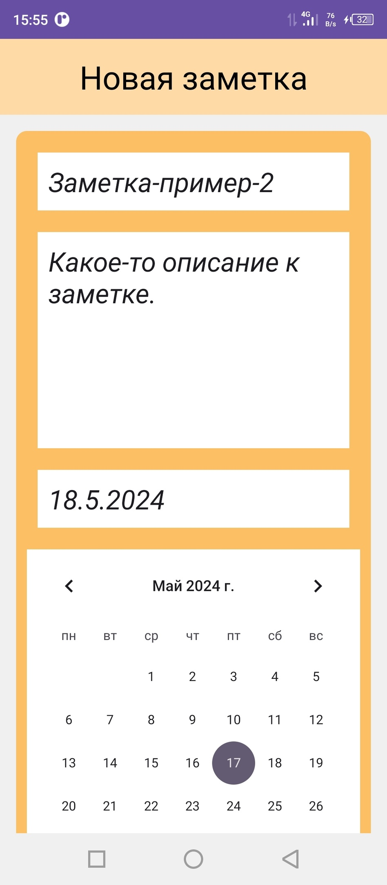
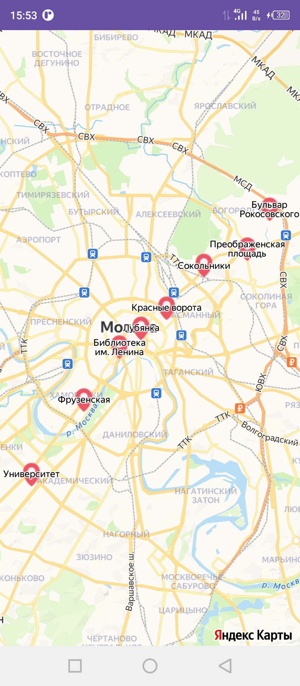
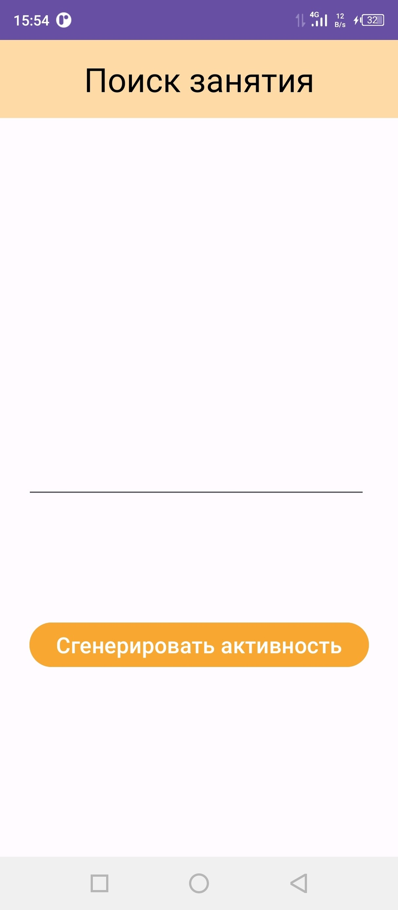
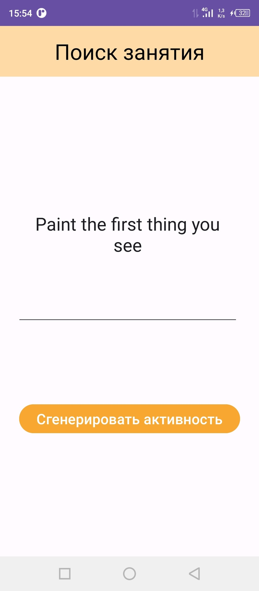

# Notes

## Описание

Андроид-приложение "Notes" поможет сохранить Ваши идеи и заметки, а для удобства пользования написанные заметки можно отсортировать по дате создания или по названию. Также приложение может придумать Вам активность, если Вы заскучаете. Еще в "Notes" можно посмотреть карту.

## Функционал
### 1. Создание заметки
Для того, чтобы создать заметку нужно нажать на кнопку "новая заметка" на главном экране после в открывшемся экране создания заметки, нужно заполнить поля: название, описание, дата. Далее нажать на кнопку "сохранить", и заметка сохранится и появится на главном экране.

### 2. Удаление заметки
Для того, чтобы удалить уже созданную заметку, нужно нажать на нужную заметку и удерживать некоторое время. После этого появиться кнопка "удалить". Необходимо нажать на эту кнопку, и заметка удалится.

### 3. Редактирование заметки
Для того, чтобы изменить содержимое уже созданной заметки, необходимо нажать на нужную заметку и в появившемся окне редактирования заметки изменить нужные поля, а после нажать на кнопку "сохранить".

### 4. Просмотр карты
Для того, чтобы посмотреть карту, нужно на главном экране нажать на кнопку "карта". После этого откроется экран с картой.

### 5. Получение случайной активности
Для того, чтобы получить случайную активность, нужно на главном экране нажать на кнопку "лампочка". После этого откроется экран "поиск занятия". Далее необходимо нажать на кнопку "сгенерировать активность", после чего на экране отобразиться случайная активность.

## Инструкция по сборке
1. откройте терминал
2. перейдите в папку проекта
3. запустите команду gradlew assembleDebug 
4. Исполняемый файл появится в Mob\app\build\outputs\apk\debug
